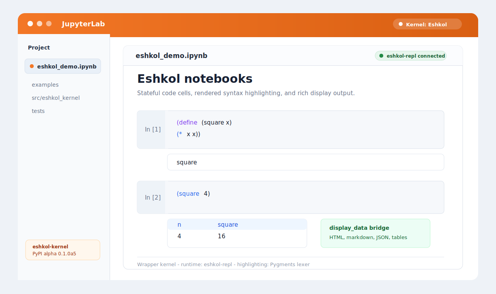

# Eshkol Jupyter Kernel

Run Eshkol in Jupyter notebooks.

`eshkol-kernel` connects JupyterLab, classic Notebook, VS Code notebooks, and
other Jupyter clients to a long-lived `eshkol-repl` process. The result is a
stateful notebook workflow for Eshkol code, examples, experiments, and published
computational notes.



## What You Get

- Stateful Eshkol execution through `eshkol-repl`
- Multiline cells and multiple top-level forms per cell
- Text output, classified errors, and ordered rich display output
- Completion for common Scheme/Eshkol forms and symbols defined in earlier cells
- Eshkol Pygments lexer for rendered notebooks, `.esk` files, and static exports
- Rich display protocol for markdown, HTML, SVG, JSON, LaTeX, PNG, tables, and trees
- One-command setup that can find or download an Eshkol runtime
- Local diagnostics for runtime, kernelspec, shared libraries, and smoke execution

The package is currently alpha but usable. Version `0.1.0a5` is published on
[PyPI](https://pypi.org/project/eshkol-kernel/).

## Install

Create a Python environment, install the package with JupyterLab, run setup, and
start Jupyter:

```bash
python3 -m venv .venv
. .venv/bin/activate
python -m pip install --upgrade pip
python -m pip install eshkol-kernel==0.1.0a5 jupyterlab
eshkol-kernel-setup --user
python -m jupyter lab
```

Create or open a notebook, select the `Eshkol` kernel, and try:

```scheme
(+ 1 2 3)
```

`eshkol-kernel-setup` uses an existing `eshkol-repl` on `PATH` when available.
If it cannot find one, it downloads the latest compatible Eshkol release into a
user cache directory, installs the Jupyter kernelspec, runs diagnostics, and
prints the next command to launch Jupyter.

To force a specific runtime:

```bash
eshkol-kernel-setup --user --eshkol-repl /absolute/path/to/eshkol-repl
```

## Runtime Model

This package does not vendor Eshkol itself. It is a Jupyter wrapper around an
Eshkol runtime.

Most users should let `eshkol-kernel-setup` configure the runtime and kernelspec:

```bash
eshkol-kernel-setup --user
eshkol-kernel-setup --user --eshkol-repl /absolute/path/to/eshkol-repl
eshkol-kernel-setup --user --runtime-dir ~/.cache/eshkol-kernel/eshkol
eshkol-kernel-setup --user --tag latest --flavor lite
eshkol-kernel-setup --sys-prefix
eshkol-kernel-setup --no-download
```

The kernel reads these environment variables when Jupyter starts it:

- `ESHKOL_REPL`: path to `eshkol-repl` (default: `eshkol-repl`)
- `ESHKOL_KERNEL_LOAD_STDLIB`: load stdlib on startup (`1` by default)
- `ESHKOL_KERNEL_REPL_ARGS`: extra arguments passed to `eshkol-repl`
- `ESHKOL_KERNEL_TIMEOUT`: per-cell execution timeout in seconds (default: `30`)
- `ESHKOL_KERNEL_START_TIMEOUT`: REPL startup timeout in seconds (default: `10`)

If Jupyter launches from an environment that does not inherit your shell
variables, bake the runtime path into the kernelspec:

```bash
eshkol-kernel-install --user --eshkol-repl /absolute/path/to/eshkol-repl
```

The fetch helper supports release tags and runtime flavors:

```bash
eshkol-kernel-fetch-runtime --tag latest --flavor lite --output .external/eshkol
```

Use `.external/` for local development setup only. The setup command downloads
into a user cache by default; production and packaged setups can point the
kernelspec at any Eshkol installation.

Linux release binaries may require system BLAS/LAPACK and LLVM runtime
libraries. The CI workflow documents the Ubuntu packages currently needed for
the downloaded Eshkol release.

## Diagnostics

`eshkol-kernel-setup` runs diagnostics automatically. Run the doctor command
directly when Jupyter cannot start the kernel or cells fail before evaluating
code:

```bash
eshkol-kernel-doctor
```

It checks the package import, platform support, `eshkol-repl` resolution, shared
library dependencies, the `Eshkol` kernelspec, and a real `(+ 1 2 3)` execution.
Point it at a specific runtime when needed:

```bash
eshkol-kernel-doctor --eshkol-repl /absolute/path/to/eshkol-repl
```

Missing kernelspecs are warnings by default so contributors can diagnose the
runtime before installing Jupyter metadata. Use `--require-kernelspec` when
validating a fully installed setup.

## Kernelspec Management

List installed kernels:

```bash
jupyter kernelspec list
```

Update or reinstall the default `Eshkol` kernelspec:

```bash
eshkol-kernel-setup --user --eshkol-repl /absolute/path/to/eshkol-repl
```

Install just the kernelspec without fetching or running diagnostics:

```bash
eshkol-kernel-install --user --eshkol-repl /absolute/path/to/eshkol-repl
```

Install a second kernelspec name for another runtime:

```bash
eshkol-kernel-install --user \
  --name eshkol-dev \
  --display-name "Eshkol Dev" \
  --eshkol-repl /absolute/path/to/dev/eshkol-repl
```

Uninstall the default kernelspec:

```bash
jupyter kernelspec uninstall eshkol
```

## Syntax Highlighting

The package registers an `eshkol` Pygments lexer for `.esk` files and rendered
notebooks. This improves exported notebooks, Sphinx/MkDocs pages, and other
Pygments-based renderers.

Live notebook editors still use Scheme-like CodeMirror behavior until a
dedicated browser-side Eshkol mode exists.

## Rich Display Output

Normal Eshkol output goes to stdout. A single output line matching this JSON
shape is published as a Jupyter `display_data` MIME bundle instead:

```json
{
  "type": "display_data",
  "data": {
    "text/plain": "hello",
    "text/html": "<strong>hello</strong>"
  },
  "metadata": {}
}
```

The kernel also understands compact helper payloads that Eshkol-side libraries
or user code can emit:

```json
{"type":"eshkol_display","format":"markdown","value":"**hello**"}
{"type":"eshkol_display","format":"html","value":"<strong>hello</strong>"}
{"type":"eshkol_display","format":"svg","value":"<svg>...</svg>"}
{"type":"eshkol_display","format":"json","value":{"answer":42}}
{"type":"eshkol_pretty","value":["define",["square","x"],["*","x","x"]]}
{"type":"eshkol_table","columns":["n","square"],"rows":[[1,1],[2,4]]}
{"type":"eshkol_tree","value":["root",["left"],["right"]]}
```

Supported `eshkol_display` formats are `text`, `html`, `markdown`, `latex`,
`svg`, `json`, `png`, and `png-base64`. The display bridge includes a
`text/plain` fallback when it creates the MIME bundle. Invalid helper payloads
remain plain stdout.

## How It Works

The kernel subclasses `ipykernel.kernelbase.Kernel`, the standard wrapper-kernel
path described by the Jupyter Client documentation. It starts `eshkol-repl` in a
pseudo-terminal because the native REPL is interactive, stateful, and prints
prompts only when attached to a terminal.

Each notebook cell is split into top-level Eshkol forms and sent to the REPL.
After each form, the kernel sends a private sentinel expression and reads until
that sentinel appears. That gives the wrapper a reliable end-of-execution marker
while keeping the same REPL state alive between cells.

## Development

```bash
git clone https://github.com/Gabriel-Kahen/eshkol-jupyter-kernel.git
cd eshkol-jupyter-kernel
python3 -m venv .venv
. .venv/bin/activate
python -m pip install --upgrade pip
python -m pip install -e '.[test,dev]'
ruff check .
python -m build
pytest
```

The default tests use a fake REPL so they can run even when Eshkol itself is not
installed. To run the real-runtime smoke tests locally:

```bash
eshkol-kernel-fetch-runtime --output .external/eshkol
ESHKOL_REAL_REPL="$PWD/.external/eshkol/bin/eshkol-repl" pytest tests/test_real_eshkol.py
eshkol-kernel-doctor --eshkol-repl "$PWD/.external/eshkol/bin/eshkol-repl" --skip-kernelspec
```

CI runs linting, package builds, fake-REPL tests, notebook execution tests, and
a separate real Eshkol smoke test that downloads the release binary.

## Release

Release publishing uses PyPI Trusted Publishing through GitHub Actions. See
[docs/RELEASING.md](docs/RELEASING.md) for the checklist.

## Known Limits

- This package targets Unix-like systems where `pexpect` can allocate a
  pseudo-terminal. macOS and Linux are the intended platforms.
- Rich display currently depends on the JSON line convention above.
- Live editor highlighting still uses Scheme-like CodeMirror behavior.
- Interrupt behavior depends on the native REPL's signal handling and the
  frontend. Restarting the kernel is the reliable reset path.
